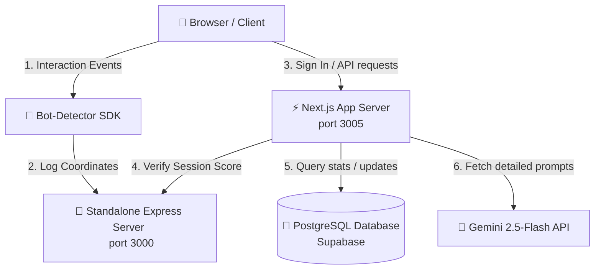

# 🚀 EduVault — Integrated DSA Prep & Bot-Shield Platform

EduVault is a premium, full-stack platform designed to help students learn Data Structures & Algorithms (DSA), track daily streaks, sync solving profiles with LeetCode, and consult an AI mentor (**Sensei**). 

The platform is secured by a decoupled, behavior-based bot detection system (**Sensei Shield**), checking client-side mouse patterns, scrolls, and typing speeds in real-time.

---

## 🏗️ The Full-Stack Architecture

Next.js is a unified framework where both **Frontend (Browser UI)** and **Backend (Server APIs)** live inside the same codebase. 

Here is how the main architectural blocks connect:



---

## 📁 File & Folder Directory Roles

Here is a breakdown of every folder and what it is responsible for:

### `src/app/` (The App Router - Frontend & Backend)
Next.js determines route files by their **file name**:
*   `page.tsx` (Frontend): Renders the visual pages in the browser.
*   `route.ts` (Backend API): Code running on the Node.js server (endpoints).

*   📂 `src/app/page.tsx` - The landing page of EduVault.
*   📂 `src/app/auth/login/page.tsx` - Login page protected by the Bot Detector.
*   📂 `src/app/auth/signup/page.tsx` - Signup page protected by the Bot Detector.
*   📂 `src/app/dashboard/roadmap/page.tsx` - Visual chatbot where the student chats with **Sensei**.
*   📂 `src/app/api/ai/route.ts` - Backend endpoint that fetches student profile context from the database and queries Gemini.

### `src/components/` (The UI Furniture)
Reusable React components that keep the code DRY (Don't Repeat Yourself).
*   📂 `src/components/layout/` - Sidebars, headers, and footers used across dashboard routes.
*   📂 `src/components/dashboard/` - Reusable charts, streaks displays, and XP cards.

### `src/lib/` (The Logic Toolbox)
Pure JavaScript/TypeScript files carrying background algorithms, database connections, and auth settings. No HTML/CSS is present here.
*   📂 `src/lib/prisma.ts` - Initializes the Prisma database client mapping.
*   📂 `src/lib/auth.ts` - Configuration file for NextAuth handlers & Google OAuth setup.
*   📂 `src/lib/streak.ts` - Heuristics to check and increment daily study streaks.
*   📂 `src/lib/bot-detector.ts` - Client SDK capturing mouse coordinates and scrolls.

### `prisma/` (Database Models)
Defines how our data tables look.
*   📂 `prisma/schema.prisma` - The Database blueprint (`User`, `DSAProblem`, `ProblemSolveLog` models).

### Infrastructure & DevOps files
*   📂 `docker-compose.monitoring.yml` - Sets up Postgres, Prometheus, and Grafana locally for testing.
*   📂 `terraform/` - Contains the AWS VPC, ECS Fargate, and RDS database cloud blueprints.

---

## 🛠️ Step-by-Step Request Lifecycle: Clicking "Sign In"

What happens under the hood when a student logs in?

1.  **Form Submission**: User enters credentials on `page.tsx` and clicks submit.
2.  **SDK Collection**: The client-side `bot-detector.ts` gathers all recorded mouse movements, click counts, and keystroke intervals.
3.  **Flush**: It sends this data block to the running didi's Express server (`localhost:3000/collect`).
4.  **Score Verification**: Before logging in, the frontend calls the scoring route (`localhost:3000/score`).
5.  **Heuristic Evaluation**: Didi's Express server runs a scoring algorithm:
    *   *Entropy*: Checks if mouse tracks are curved and human-like.
    *   *Metronomic speed*: Checks if clicks are spaced out in random ms (Humans) or exact microsecond intervals (Bots).
6.  **Scoring Response**: Didi's server prints the verification result in the terminal and returns a score:
    *   `score >= 0.5` ➡️ Human Verified. Proceed to authenticate via NextAuth (`src/lib/auth.ts`).
    *   `score < 0.5` ➡️ Bot Detected. Display error toast and block submission.

---

## 🚀 Running Locally

To run the full stack locally:

### 1. Start the Bot Detection Service
Open a terminal in your `crawler-detect` project folder:
```bash
cd crawler-detect/server
npm install
npm run dev
```
*(Runs the Express server on `http://localhost:3000`)*

### 2. Start the EduVault App
Open a second terminal inside `eduvault` project:
```bash
cd eduvault
npm install
npm run dev
```
*(Runs Next.js app on `http://localhost:3005`)*

Open **[http://localhost:3005/auth/login](http://localhost:3005/auth/login)** to log in, and monitor live logs on **[http://localhost:3000/dashboard](http://localhost:3000/dashboard)**!
